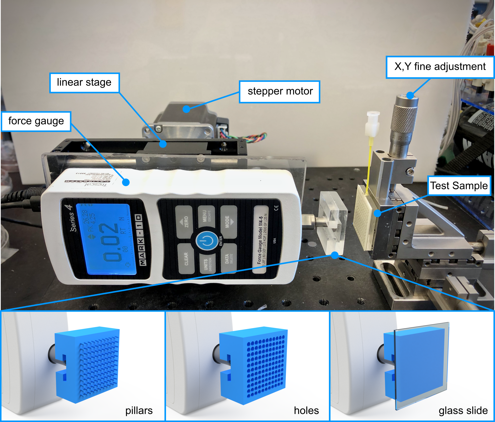
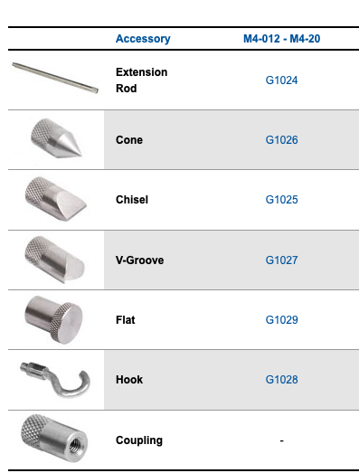
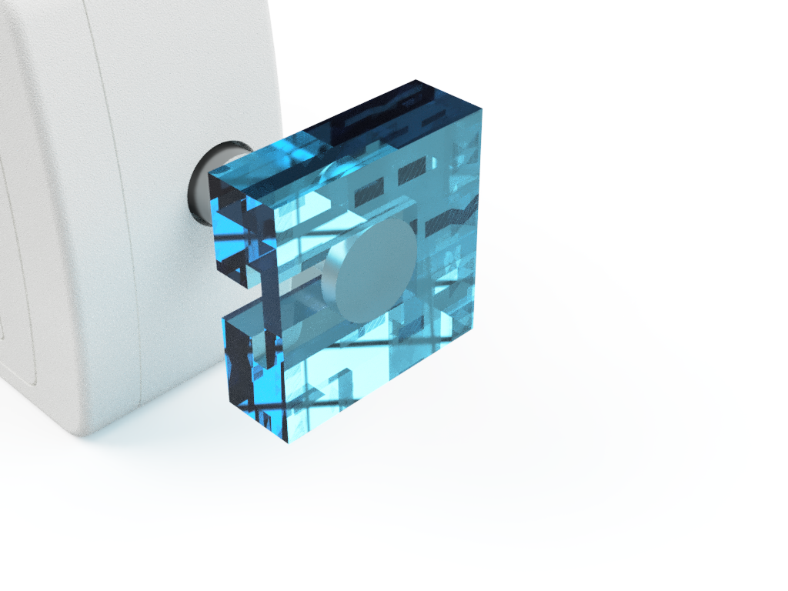
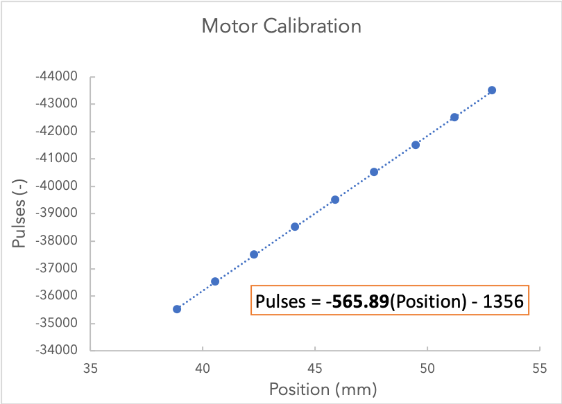
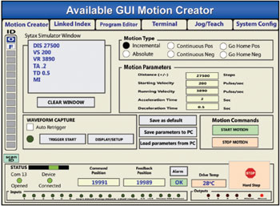
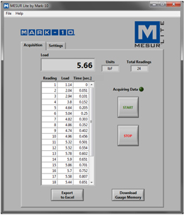

# Hattonlab Adhesion-Tester

This is the repository and working instructions for the linear-force tester in the HATTONLAB at the University of Toronto. This device is designed to test various forces under linear displacement. For example: Adhesion, Friction, or Tensile Strength. The device is built upon a modular breadboard which means it can be modified to run many different tests.



### Force Capacity, Resolution, and Accuracy

The Mark-10 M4 25N has a working range of +-25N with a resolution of  0.01N and accurate to +-0.2% of 25N.

# Construction & Components

Physical Base:
- Base breadboard (Newport Aluminum 1ftx1ft Breadboard)
- Linear Rail and aluminum plate (From an old printer)
- X,Y fine adjustment & Sample holder (Newport 461)
- Force Gauge to Linear Rail coupling plate (custom milled)
- Stepper Motor to Linear Rail coupling (McMaster Carr ???)

Electrical Components:
- Stepper motor/Motor controller (Oriental Motor)
- Force gauge and Accessory Kit (Mark-10 M4 25N)
- USB to RS-485 converter

Attachment Tips: 
The force gauge included the following attachment tips:



A custom milled attachment piece has also been created to attach onto the 'flat accessory to generate a larger surface area (1.2"x1.2").



### Calibration

A correlation between motor steps (pulses) and distance travelled was used to calibrate the machine:

Using the following controller configuration:

Any change to these settings will require a recalibration. 

At current: 1mm = 566pulses

Example: 
```
Real Displacement and Rate: 50mm at 2mm/s
Pulses: 28350pulse at 1132pulse/s
```

#### Calibration Steps:

1. Open the Motion Creator App. 
2. Measure the distance between two points on the linear rail.
3. Create a movement operation for a known number of 'steps/pulses' (e.g. 1000). 
4. Measure the new distance between the two points. Do this for an adequant number of times.
5. Plot a Position vs Pulse chart and extract the slope. The slope represents the number of pulses required to move 1mm.



# Operation Modes

There are two methods of control:

1. **Manual** (basic): Motion and force are indepentely controlled through proprietary graphical software Why manual control?

   - It is easier to get started
   - Requires no knowledge of scripting or MATLAB

2. **Script** (advanced): MATLAB scripting that allows for automated, precise, and advanced test parameters (e.g. Force limiting) 

   Why script control?

   - **Linked Data**: Position and Load start/stop recording at equal times and record at equal rates
   - **Load Control**: This allows you to reach precise preloads, and have motions based on the load such as stopping at failure (0 load) or reaching precise preloads.
   - **Autonomous Testing**: single button to start testing can perform multiple tests, save data, and interact with tertiary devices such as pneumatics

## 1. Manual Control
Manual control uses proprietary software to separately control the force gauge and stepper motor. 

### Software Required

#### Stepper Motor Software: CRK Motion Creator

This allows you to change the gearing, jog the motor, and write scripts for motion. [Download Link](https://www.orientalmotor.com/downloads/software.html#)




#### Force Gauge Software: MESUR Lite

This allows you to record force gauge reading and export to Excel. [Download Link](https://www.mark-10.com/instruments/software/mesurlite.html)



### Running a Manual Test

1. Open Both MESUR Lite and CRK Motion Creator
2. Enter desired motion commands such as velocity, acceleration and distance using the calibration above
3. Jog the stepper motor to the starting postion
4. Start recording in MESUR (make sure record rate and max data points are set in Settings)
5. Press start on the motion commands
6. Allow test to run
7. Stop recording on MESUR and export data to Excel

## 2. Script Control

The scripting program used in this work is MATLAB.

### Running a Scripted Test

1. Write a script using the commands and examples below:
2. Jog the motor into place using CRK Motion Creator
3. input start position and any other variables into script
4. Run the script

# Writing Commands

#### Connecting the Instruments

The first step is to connect the instruments through serial connection.

This is a Matlab function that connects the force gauge and stepper motor.

```matlab
function [force_gauge, step_motor] = connect_instruments()
%connect_instruments Connects Mark-10 force gauge and step motor

    % These serial ports should be changed depending on the computer

    % Connect Force Gauge
    force_gauge = serial('COM6');
    force_gauge.Baudrate = 115200;
    fopen(force_gauge);

    % Connect Step Motor
    step_motor = serial('COM7');
    fopen(step_motor);
    step_motor.RecordDetail ='Verbose';
    record(step_motor)
end
```

## Stepper Motor Commands

Once the instruments are connected, they can receive and send information through writing through the Serial Port.

The full list of commands can be found in Section 13 Command List from the Controller Operating Manual.

However, these are some of the most utilized commands:

| Command | Function                                                     |
| ------- | ------------------------------------------------------------ |
| TA / TD | Acceleration and deceleration time, respectively             |
| DIS     | Distance to move in pulses. Define this before the MI command |
| VS / VR | Starting Velocity and running velocity, respectively         |
| MA      | Move Absolute. Moves to                                      |
| MI      | Move Incrementally (start motion) and continue until distance has been achieved |
| PSTOP   | Panic stop: Hard stop, system state after stop is defined by ALMACT |
| HSTOP   | Hard stop: stop as quickly as possible                       |
| SSTOP   | Soft stop: controlled deceleration over time                 |

The code does not currently use the following commands but they might be useful

| Command | Function               |
| ------- | ---------------------- |
| MEN     | Wait for Motion to end |
| WAIT    | Time delay (seconds)   |

**IMPORTANT**:The absolute position is reset to 0 if unplugged. Therefore,  if using the MA command, it is **EXTREMELY** important to check the starting position before starting a MATLAB script. In future versions,  'home seeking' would solve this issue. 

### Example: 

Move the force gauge back 15mm at 2mm/s with minimal ramp up time. The original pulse position is 117000.

Data to the step motor is expected in the following format: 

```
COMMAND VALUE
example: VS 1000
```

Distance Method (dont use if possible):

```matlab
fprintf(step_motor, 'TA 0.1') % ramp up time
fprintf(step_motor, 'TD 0.1') % ramp down time
fprintf(step_motor, 'VS 1132'); % starting velocity 2mm/s * 566pulse/mm = 1132
fprintf(step_motor, 'VR 1132'); % running velocity
fprintf(step_motor, 'DIS -120000'); % distance to travel -15mm * 566pulse/mm = 8490
fprintf(step_motor, 'MI'); % start motion
```

Abosolute Movement Method (preffered):

```matlab
fprintf(step_motor, 'TA 0.1') % ramp up time
fprintf(step_motor, 'TD 0.1') % ramp down time
fprintf(step_motor, 'VS 1132'); % starting velocity 2mm/s * 566pulse/mm = 1132
fprintf(step_motor, 'VR 1132'); % running velocity
fprintf(step_motor, 'MA &s\n',num2str(117000-8490)); % distance to travel -15mm * 566pulse/mm = 8490.. 

```

*During early testing, it was found that the stepper motor would sometimes miss move commands. This can be hazerdous to the machine if the motor moves bi-directionally. For example, the force gauge may ram into the substrate and overload if a 'move back' command is missed, leading to two sequental 'move forward commands'. Therefore, it is recommended to use position commands (MA) instead of distance commands (MI).*

## Force Gauge Commands

Once connected, the force gauge will return the current load when asked.

Sample Code:

```matlab
fprintf(force_gauge,char('?',13,10));
resp = fscanf(force_gauge);
```

This snippet writes a serial command to the force gauge, asking for the current char. It then reads the reponse and stores the force as 'resp'.

## Sample Test

This is a simple tensile test that retracts the force gauge at a constant rate for a determined distance. Examples in the code section demonstrate more complex functions such as additional states (approaching, dwelling, and retracting), and force control (preloading, test termination at 0 force etc..).

```matlab
% This is a basic tensile test
%% CONNECT INSTRUMENTS
delete(instrfind)
clear;

force_gauge = serial ('COM6');
force_gauge.Baudrate = 115200;
fopen(force_gauge);

step_motor = serial('COM7');
fopen(step_motor);
step_motor.RecordDetail = 'Verbose';
record(step_motor)

%% USER INPUT VARIABLES
alarm_force = 25; % Force (N) to trigger the alarm
approach_velocity = 1 % enter approach velocity in mm/s
retract_velocity = 2 % enter retract velocity in mm/s
start_position = 115000 % IMPORTANT start position in pulses
distance = 15 % distance to move in mm
reading delay = 0.25; % time between collected data points.. 0.25 = 4 reading/s
%% INITIZIALIZATION
retract_velocity_pulse = retract_velocity*566;
retract_distance_pulse = distance*566;
paused = false;
pause_time = 0;
pause_target = 0;
retract = true;
test_done = false;

data = zeros (10,1); %Create the data matrix for storing force
count = 1;

fprintf(step_motor, 'TA 0.1'); %sets ramp times to as quick as possible
fprintf(step_motor, 'TD 0.1');

%% TEST LOOP
while(running_test)

% Force Recording
fprintf(force_gauge,char('?',13,10));
resp = fscanf(force_gauge);
current_force = str2double(resp(1:end-3));
data(count) = current force;
count = count+1;

% Alarms that quit the program to save the force gauge from overloading
if current_force > alarm_force 
test_done=true
fprintf(step_motor,'ABORT');
pause (0.01);
fprintf(step_motor, 'DIS -20000');
fprintf(step_motor, 'MI');
disp ('ERROR: FORCE OVERLOAD. RETRACTING AND QUITTING')
pause (20);
delete(instrfind)
end
if current_force<(-1*alarm_force)
test_done=true
fprintf(step_motor,'ABORT');
pause(0.01);
fprintf(step_motor, 'DIS 1000');
fprintf(step_motor, 'MI');
disp ('ERROR: NEGATIVE FORCE OVERLOAD. PUSHING AND QUITTING')
delete(instrfind);
end
%-- end of alarm section

% Test states. This example includes only a retract state. Add additional states such as approach and dwell for more complex testing

if ~paused && retract
disp ('Pulling Surfaces Apart')
pause (0.01);
fprintf(step_motor, 'VS %s\n', num2str(retract_velocity_pulse));
pause (0.01);
fprintf(step_motor, 'VR %s\n', num2str(retract_velocity_pulse));
pause (0.01);
fprintf(step_motor, 'MA %s\n', num2str(start_position - retract_distance_pulse ) )

pause_target = (4+ double(distance)/double(retract_velocity))
retract=false;
paused=true;
test_done=true;

elseif ~paused && test_done
running_test = false;

elseif paused
pause_time = pause_time+1;
if pause_time >=pause target
paused=false;
pause_time=0;
end
end
pause(reading_delay);
end
%% POST TEST DATA WRITING
writematrix(data, ['data/',datestr(now,'mm-dd-yyyy-HHMM'), 'testname.csv')];
disp('TEST DONE')
```

